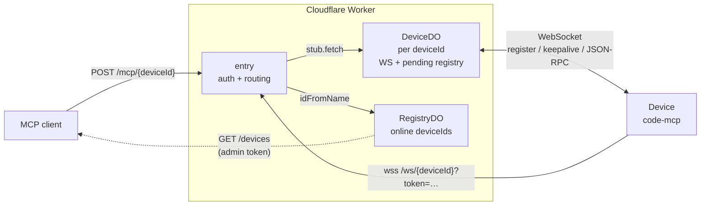

# Code MCP Gateway

**Cloudflare Worker gateway that exposes local code-mcp devices to MCP clients over the internet, with per-device authentication and Durable-Object colocation.**

[](https://github.com/Tuanm/code-mcp-gateway/actions/workflows/ci.yml)

## Properties

| Property | How it is achieved |
| --- | --- |
| **Global & auto-scaling** | Runs on Cloudflare Workers; every isolate routes to the same Durable Object per `deviceId` |
| **Secure** | Per-device tokens on both the device WebSocket and the MCP relay; `/devices` is never public; unknown ids return 401 (no existence oracle); admin UI behind Cloudflare Access |
| **Long tool calls** | Durable Objects have unlimited wall time while the client is connected; `TIMEOUT_MS` defaults to 300 s |
| **Zero servers** | No VM to patch or scale; Durable Objects hibernate when idle (WebSocket Hibernation API) |

## How it works



- A device connects once via WebSocket; its tunnel and pending requests are owned by one Durable Object, so any isolate can serve `/mcp` requests for it.
- Authentication happens **before** any Durable Object is created — unauthenticated probes cost nothing and reveal nothing.
- `GET /devices` is hidden (404) when no admin token is configured, and admin-gated (401) otherwise.

## Quick start

```bash
cd worker
npm install
npx wrangler secret put DEVICE_TOKENS    # JSON map, e.g. {"my-device":"my-secret"}
npx wrangler secret put ADMIN_TOKEN      # optional: gates GET /devices
npx wrangler deploy
```

| Endpoint | Purpose |
| --- | --- |
| `wss://<worker>/ws/<deviceId>?token=<deviceToken>` | Device connects to its tunnel |
| `POST <worker>/mcp/<deviceId>?token=<deviceToken>` | MCP client relays a JSON-RPC call |

## Documentation

- [worker/README.md](worker/README.md) — architecture, security model, deploy, tunables, test
- [worker/src](worker/src) — entry point, DeviceDO, RegistryDO, config
- [MCP specification](https://modelcontextprotocol.io) — the JSON-RPC protocol this gateway transports

## Development

```bash
cd worker
npm test          # smoke suite: 21 scenarios against local wrangler instances
npm run typecheck # tsc --noEmit
npm run deploy
```
