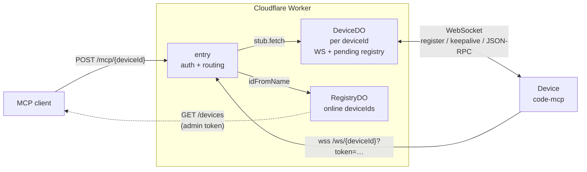

# Code MCP Gateway

**Cloudflare Worker gateway that exposes local code-mcp devices to MCP clients over the internet, with per-device authentication and Durable-Object colocation.**

[](https://github.com/Tuanm/code-mcp-gateway/actions/workflows/ci.yml)

## Properties

| Property | How it is achieved |
| --- | --- |
| **Global & auto-scaling** | Runs on Cloudflare Workers; every isolate routes to the same Durable Object per `deviceId` |
| **Secure** | Per-device tokens on both the device WebSocket and the MCP relay; `/devices` is never public; unknown ids return 401 (no existence oracle); admin UI behind Cloudflare Access |
| **Long tool calls** | Durable Objects have unlimited wall time while the client is connected; `TIMEOUT_MS` defaults to 300 s |
| **Zero servers** | No VM to patch or scale; Durable Objects hibernate when idle (WebSocket Hibernation API) |

## How it works


```mermaid
flowchart LR
    C[MCP client] -->|"POST /mcp/{deviceId}"| W
    D[Device<br/>code-mcp] -->|"wss /ws/{deviceId}?token=…"| W
    subgraph Worker [Cloudflare Worker]
        W[entry<br/>auth + routing]
        DO[DeviceDO<br/>per deviceId<br/>WS + pending registry]
        R[RegistryDO<br/>online deviceIds]
    end
    W -->|stub.fetch| DO
    W -->|idFromName| R
    DO <-->|"WebSocket<br/>register / keepalive / JSON-RPC"| D
    R -.->|"GET /devices<br/>(admin token)"| C
```

- A device connects once via WebSocket; its tunnel and pending requests are owned by one Durable Object, so any isolate can serve `/mcp` requests for it.
- Authentication happens **before** any Durable Object is created — unauthenticated probes cost nothing and reveal nothing.
- `GET /devices` is hidden (404) when no admin token is configured, and admin-gated (401) otherwise.

## Quick start

```bash
cd worker
npm install
npx wrangler secret put DEVICE_TOKENS    # JSON map, e.g. {"my-device":"my-secret"}
npx wrangler secret put ADMIN_TOKEN      # optional: gates GET /devices
npx wrangler deploy
```

| Endpoint | Purpose |
| --- | --- |
| `wss://<worker>/ws/<deviceId>?token=<deviceToken>` | Device connects to its tunnel |
| `POST <worker>/mcp/<deviceId>?token=<deviceToken>` | MCP client relays a JSON-RPC call |
| `POST <worker>/api/files?name=&expiry_days=&key=` | Upload a temporary file (device Basic auth; streamed into R2) |
| `GET <worker>/api/files/{id}` | Download it (supports `Range`) |
| `GET <worker>/files` | File management page (device Basic auth) |

## Temporary files

Devices can park temporary files on the gateway and share a link:

```bash
curl -u demo:demo --data-binary @report.pdf \
  "https://code-mcp.tuanm.workers.dev/api/files?name=report.pdf&expiry_days=7"
```

Auth is HTTP Basic with the device's own `deviceId`/`token` (the pair
registered at `/admin`). A protected file's key is passed as the
`X-File-Key` **request header**, never in the URL, so it cannot end up in an
access log or a `Referer`. Limits: 200 MiB per file, 7 days, 5 files and
500 MiB per device. Expired files are deleted automatically and never listed.
Requires an R2 bucket bound as `BUCKET` - see
[worker/README.md](worker/README.md#temporary-files).

## CLI

`cli/` builds `mcp`, a fast, dependency-free command line client for the
gateway: connect devices, list and inspect tools, and call one or many tools
from inline JSON, paired arguments or stdin.

```text
mcp devices connect my-laptop --token dev-secret --gateway https://gw.example.dev
mcp devices list
mcp tools list my-laptop
mcp tools call my-laptop.click '{"selector":"#submit"}'
```

Credentials and defaults live in `~/.code-mcp-gateway/config.yaml`; flags override
environment variables, which override the device entry, which overrides the
defaults section. `mcp --help` lists everything, and `mcp call` is an alias for
`mcp tools call`.

## Documentation

- [cli/README.md](cli/README.md) - the `mcp` CLI: install, commands, configuration, exit codes
- [worker/README.md](worker/README.md) — architecture, security model, deploy, tunables, test
- [worker/src](worker/src) — entry point, DeviceDO, RegistryDO, config
- [MCP specification](https://modelcontextprotocol.io) — the JSON-RPC protocol this gateway transports

## Development

```bash
cd worker
npm test          # smoke suite: 21 scenarios against local wrangler instances
npm run typecheck # tsc --noEmit
npm run deploy
```

Device-issued files can also be downloaded through authenticated
`GET /mcp/{deviceId}/download/{ticket}` with `X-Device-Token` and gateway
credentials. See [download protocol and curl usage](worker/README.md#ticket-based-file-downloads).
