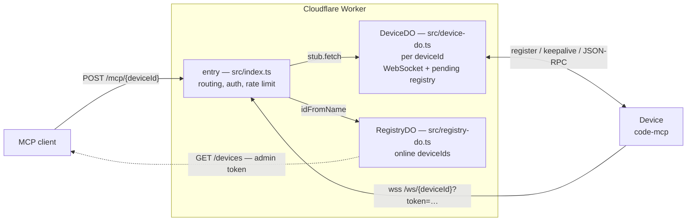
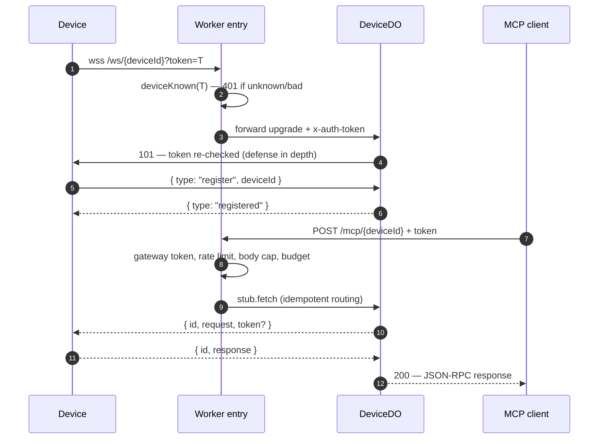

# Code MCP Gateway — Cloudflare Worker

**Production gateway for exposing code-mcp devices to MCP clients, built on Cloudflare Workers + Durable Objects. Per-device authentication, long-call support, zero servers.**

## Overview

| Topic | Answer |
| --- | --- |
| **What** | WebSocket tunnel gateway: a device connects once; MCP clients relay JSON-RPC calls to it over HTTP |
| **Where** | Cloudflare Worker + Durable Objects (needs a **Paid** plan) |
| **Why DOs** | A Worker's memory is per-isolate; only a Durable Object per `deviceId` guarantees every `/mcp` request finds the device's WebSocket |
| **Protocol** | Wire-compatible with the code-mcp device protocol: register / keepalive / JSON-RPC envelope |
| **Cost model** | Idle tunnels hibernate (WebSocket Hibernation API); no servers to run |

## Architecture



| Component | Responsibility |
| --- | --- |
| `src/index.ts` | Route `/devices`, `/mcp/{id}`, `/ws`; gateway + device auth **before** any DO; per-isolate rate limiting; origin whitelist |
| `src/device-do.ts` | One object per device: owns the WebSocket, pending-request registry, request timeout, keepalive watchdog (alarm-driven), per-device pending budget |
| `src/registry-do.ts` | Single shared object: online deviceIds for `GET /devices`, persisted, TTL-swept |
| `src/config.ts`, `src/rate-limit.ts`, `src/protocol.ts` | Env config + helpers, limiter, tunnel envelope types |

### Request flow



## Deploy

```bash
cd worker
npm install
npx wrangler secret put DEVICE_TOKENS   # REQUIRED for secure deployments
npx wrangler secret put ADMIN_TOKEN     # optional — gates GET /devices
npx wrangler deploy
```

### Secrets

| Secret | Required | Effect |
| --- | --- | --- |
| `DEVICE_TOKENS` | recommended | JSON map `{"deviceId":"token",…}`; authenticates devices at `/ws` and relay requests at `/mcp` |
| `DEVICE_TOKEN` | optional | Shared fallback token for all devices when no per-device map is set |
| `GATEWAY_TOKEN` | optional | Client → gateway bearer auth for `/mcp/*` |
| `ADMIN_TOKEN` | optional | `GET /devices` auth (defaults to `GATEWAY_TOKEN`); endpoint hidden (404) when neither is set |
| `VIRTUAL_DEVICE_TOKENS` | for cloud device | JSON map `{"cloud":"token",…}`; credentials for the in-process virtual device |

## Cloud device (virtual device + coding sandbox)

The gateway also exposes an **in-process device** (`deviceId: cloud`, from `VIRTUAL_DEVICE_IDS`) that needs no tunnel. Its tools run in the Worker against Cloudflare services, and — for shell/file/jobs — inside a **Cloudflare Container** (dev image: node, bun, python, git, bash, ripgrep; see `Dockerfile` + `src/coding-sandbox.ts`).

Tools (code-mcp naming convention): `bash`, `read`, `write`, `ls`, `job`, `fetch`, `search`, `kv`, `sql`, `guide`. The sandbox is the only place with real processes: plain Workers cannot spawn them.

| Component | Responsibility |
| --- | --- |
| `src/cloud-device.ts` | In-process MCP server for virtual devices; routes tools to KV/D1 or the sandbox |
| `src/coding-sandbox.ts` | `CodingSandbox` — Container DO with RPC methods (`shellRun`, `fs*`, `job*`) |
| `Dockerfile` | Dev image built on deploy (needs a local Docker daemon, e.g. `colima start`) |

Deploy requires the `[[containers]]` binding + a `CODING_SANDBOX` DO binding + migration `v2`. First deploy builds/pushes the image and provisions the container (can take a few minutes).

Token transport on any endpoint: `Authorization: Bearer <token>`, `?auth=<token>`, `?token=<token>`, or `X-Device-Token` (device credentials).

### Tunables (`[vars]` in `wrangler.toml`)

| Variable | Default | Meaning |
| --- | --- | --- |
| `TIMEOUT_MS` | `300000` | Per-request relay timeout — 5 min for long tool calls |
| `MAX_PENDING_PER_DEVICE` | `100` | Concurrent in-flight requests per device (503 when full) |
| `MAX_BODY_BYTES` | `1048576` | Request body cap (413) |
| `KEEPALIVE_TIMEOUT_MS` | `90000` | Drop tunnel after this long with no frame (alarm-driven) |
| `PING_INTERVAL_MS` / `PING_MAX_MISSES` | `30000` / `2` | Server-side ping cadence / misses before reap |
| `IDLE_TIMEOUT_MS` | `120000` | Hibernation idle threshold |
| `RATE_LIMIT_WINDOW_MS` / `RATE_LIMIT_MAX` | `60000` / `100` | Per-isolate in-memory limiter |
| `ALLOWED_ORIGINS` | unset | Comma-separated WS origin whitelist (403 otherwise) |

> **Long tool calls** — Durable Objects and incoming HTTP requests have
> **unlimited wall time** while the caller stays connected; only CPU time is
> billed. With `TIMEOUT_MS` at 300 s and the device's 25 s keepalive, long
> operations (recording, `wait_for`, downloads) relay correctly.

## Security model

| Goal | Control |
| --- | --- |
| No one can hijack a deviceId | Per-device token required at `/ws` connect, re-checked inside the DO; duplicate registration → 409 |
| No one can intercept relay traffic | Same token required on `/mcp` before the DO is touched |
| No existence oracle | Unknown deviceId → identical 401; no DO created for unauthenticated probes |
| No roster leak | `/devices` hidden (404) without admin token; admin-gated (401) otherwise |
| Admin UI | `/admin` + registry API behind Cloudflare Access (identity policy configured in the dashboard) |
| No register takeover | Register message with a different deviceId is rejected |
| No slow-device DoS | Per-device pending budget; body cap (413) |
| No stale tunnels | Keepalive alarm drops dead tunnels |
| No brute force | Per-isolate rate limit + optional Cloudflare edge rule on `CF-Connecting-IP` (client-spoof-proof) |
| No cross-device leakage | One DO = one device; a WS can only resolve its own pendings |

## API

| Method | Path | Auth | Purpose |
| --- | --- | --- | --- |
| `GET` | `/admin` | Cloudflare Access | Device registry UI (operator) |
| `GET` / `POST` / `DELETE` | `/admin/api/devices(/{id})` | Cloudflare Access | List / register / remove devices |
| `GET` | `/devices` | admin token | List online devices (machine endpoint) |
| `POST` | `/mcp/{deviceId}` | gateway + device | Relay JSON-RPC body to the device; `X-Device-Token`/ `?token=` forwarded as relay token |
| `WS` | `/ws/{deviceId}` | device | Device WebSocket (preferred) |
| `WS` | `/ws?deviceId=<id>` | device | Legacy device WebSocket |

> **Admin UI** — `/admin` and `/admin/api/*` are protected by **Cloudflare
> Access**; the identity policy is configured in the Cloudflare dashboard.
> `GET /devices` uses the admin token instead, so scripts can query it
> without an Access session.

## Local development

```bash
cd worker
npm run dev          # wrangler dev --local (miniflare/workerd on :8787)
npm test             # 21 smoke scenarios on local wrangler instances
npm run typecheck    # tsc --noEmit
```

Smoke coverage: gateway/device auth, duplicate-registration rejection, register-message takeover blocking, end-to-end JSON-RPC relay, cross-device response blocking, request timeout, body cap, pending budget, origin whitelist, keepalive ack, invalid deviceId, `/devices` listing + hidden-without-admin, per-device unknown-id 401, relay-token forwarding, long-call relay.

> **Miniflare note** — local DO state persists under `.wrangler/state`. After a
> hard kill, stale sockets linger until the keepalive alarm fires; for a clean
> run: `rm -rf worker/.wrangler/state` before starting.
