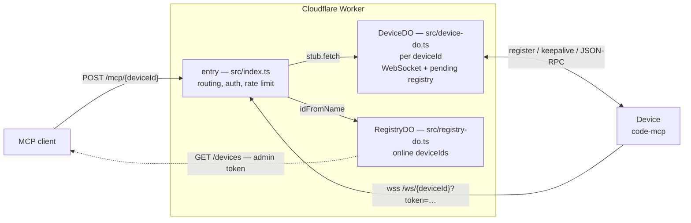
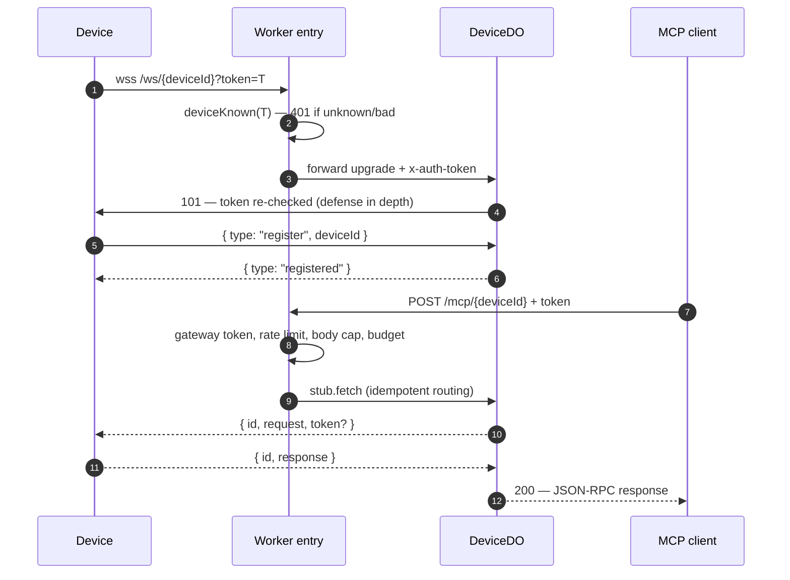

# Code MCP Gateway — Cloudflare Worker

**Production gateway for exposing code-mcp devices to MCP clients, built on Cloudflare Workers + Durable Objects. Per-device authentication, long-call support, zero servers.**

## Overview

| Topic | Answer |
| --- | --- |
| **What** | WebSocket tunnel gateway: a device connects once; MCP clients relay JSON-RPC calls to it over HTTP |
| **Where** | Cloudflare Worker + Durable Objects (needs a **Paid** plan) |
| **Why DOs** | A Worker's memory is per-isolate; only a Durable Object per `deviceId` guarantees every `/mcp` request finds the device's WebSocket |
| **Protocol** | Wire-compatible with the code-mcp device protocol: register / keepalive / JSON-RPC envelope |
| **Client transports** | **Streamable HTTP** (`POST /mcp/{id}`) and **HTTP with SSE** (`GET /sse/{id}` + `POST /messages/{id}`) — auth-identical, both relay over the device tunnel |
| **Cost model** | Idle tunnels hibernate (WebSocket Hibernation API); no servers to run |

## Architecture


```mermaid
flowchart LR
    C[MCP client] -->|"POST /mcp/{deviceId}"| W
    D[Device<br/>code-mcp] -->|"wss /ws/{deviceId}?token=…"| W
    subgraph CF [Cloudflare Worker]
        W[entry — src/index.ts<br/>routing, auth, rate limit]
        DO[DeviceDO — src/device-do.ts<br/>per deviceId<br/>WebSocket + pending registry]
        R[RegistryDO — src/registry-do.ts<br/>online deviceIds]
    end
    W -->|stub.fetch| DO
    W -->|idFromName| R
    DO <-->|"register / keepalive / JSON-RPC"| D
    R -.->|"GET /devices — admin token"| C
```

| Component | Responsibility |
| --- | --- |
| `src/index.ts` | Route `/devices`, `/mcp/{id}`, `/ws`; gateway + device auth **before** any DO; per-isolate rate limiting; origin whitelist |
| `src/device-do.ts` | One object per device: owns the WebSocket, pending-request registry, request timeout, keepalive watchdog (alarm-driven), per-device pending budget |
| `src/registry-do.ts` | Single shared object: online deviceIds for `GET /devices`, persisted, TTL-swept |
| `src/config.ts`, `src/rate-limit.ts`, `src/protocol.ts` | Env config + helpers, limiter, tunnel envelope types |

### Request flow


```mermaid
sequenceDiagram
    autonumber
    participant D as Device
    participant W as Worker entry
    participant DO as DeviceDO
    participant C as MCP client

    D->>W: wss /ws/{deviceId}?token=T
    W->>W: deviceKnown(T) — 401 if unknown/bad
    W->>DO: forward upgrade + x-auth-token
    DO->>D: 101 — token re-checked (defense in depth)
    D->>DO: { type: "register", deviceId }
    DO-->>D: { type: "registered" }

    C->>W: POST /mcp/{deviceId} + token
    W->>W: gateway token, rate limit, body cap, budget
    W->>DO: stub.fetch (idempotent routing)
    DO-->>D: { id, request, token? }
    D-->>DO: { id, response }
    DO-->>C: 200 — JSON-RPC response
```

## Deploy

Use Node.js 22 or newer and the repository's locked Wrangler 4 dependencies.
The production configuration includes a container image; Docker with the buildx
plugin must be available. The local test configuration omits containers.

```bash
cd worker
npm install
npx wrangler secret put DEVICE_TOKENS   # REQUIRED for secure deployments
npx wrangler secret put ADMIN_TOKEN     # optional — gates GET /devices
npx wrangler deploy
```

### Secrets

| Secret | Required | Effect |
| --- | --- | --- |
| `DEVICE_TOKENS` | recommended | JSON map `{"deviceId":"token",…}`; authenticates devices at `/ws` and relay requests at `/mcp` |
| `DEVICE_TOKEN` | optional | Shared fallback token for all devices when no per-device map is set |
| `GATEWAY_TOKEN` | optional | Client → gateway bearer auth for `/mcp/*` |
| `ADMIN_TOKEN` | optional | `GET /devices` auth (defaults to `GATEWAY_TOKEN`); endpoint hidden (404) when neither is set |
| `VIRTUAL_DEVICE_TOKENS` | for cloud device | JSON map `{"cloud":"token",…}`; credentials for the in-process virtual device |

## Cloud device (virtual device + coding sandbox)

The gateway also exposes an **in-process device** (`deviceId: cloud`, from `VIRTUAL_DEVICE_IDS`) that needs no tunnel. Its tools run in the Worker against Cloudflare services, and — for shell/file/jobs — inside a **Cloudflare Container** (dev image: node, bun, python, git, bash, ripgrep; see `Dockerfile` + `src/coding-sandbox.ts`).

Tools (code-mcp naming convention): `bash`, `read`, `write`, `ls`, `job`, `fetch`, `search`, `kv`, `sql`, `guide`. The sandbox is the only place with real processes: plain Workers cannot spawn them.

| Component | Responsibility |
| --- | --- |
| `src/cloud-device.ts` | In-process MCP server for virtual devices; routes tools to KV/D1 or the sandbox |
| `src/coding-sandbox.ts` | `CodingSandbox` — Container DO with RPC methods (`shellRun`, `fs*`, `job*`) |
| `Dockerfile` | Dev image built on deploy (needs a local Docker daemon, e.g. `colima start`) |

Deploy requires the `[[containers]]` binding + a `CODING_SANDBOX` DO binding + migration `v2`. First deploy builds/pushes the image and provisions the container (can take a few minutes).

Token transport on any endpoint: `Authorization: Bearer <token>`, `?auth=<token>`, `?token=<token>`, or `X-Device-Token` (device credentials).

### Tunables (`[vars]` in `wrangler.toml`)

| Variable | Default | Meaning |
| --- | --- | --- |
| `TIMEOUT_MS` | `300000` | Per-request relay timeout — 5 min for long tool calls |
| `MAX_PENDING_PER_DEVICE` | `100` | Concurrent in-flight requests per device (503 when full) |
| `MAX_BODY_BYTES` | `1048576` | Request body cap (413) |
| `KEEPALIVE_TIMEOUT_MS` | `90000` | Drop tunnel after this long with no frame (alarm-driven) |
| `TUNNEL_REPLACE_GRACE_MS` | `5000` | An authenticated reconnect may take over a tunnel idle this long (fast reconnect after a silent drop) |
| `PING_INTERVAL_MS` / `PING_MAX_MISSES` | `30000` / `2` | Server-side ping cadence / misses before reap |
| `IDLE_TIMEOUT_MS` | `120000` | Hibernation idle threshold |
| `RATE_LIMIT_WINDOW_MS` / `RATE_LIMIT_MAX` | `60000` / `100` | Per-isolate in-memory limiter |
| `ALLOWED_ORIGINS` | unset | Comma-separated WS origin whitelist (403 otherwise) |
| `SSE_IDLE_TIMEOUT_MS` | `120000` | Close an SSE session after this long with no activity (stream-spam guard) |
| `MAX_SSE_SESSIONS` | `32` | Cap concurrent SSE streams per device (memory guard → `503` when full) |

> **Long tool calls** — Durable Objects and incoming HTTP requests have
> **unlimited wall time** while the caller stays connected; only CPU time is
> billed. With `TIMEOUT_MS` at 300 s and the device's 25 s keepalive, long
> operations (recording, `wait_for`, downloads) relay correctly.

## Security model

| Goal | Control |
| --- | --- |
| No one can hijack a deviceId | Per-device token required at `/ws` connect, re-checked inside the DO; duplicate registration → 409 |
| No one can intercept relay traffic | Same token required on `/mcp` before the DO is touched |
| No existence oracle | Unknown deviceId → identical 401; no DO created for unauthenticated probes |
| No roster leak | `/devices` hidden (404) without admin token; admin-gated (401) otherwise |
| Admin UI | `/admin` + registry API behind Cloudflare Access (identity policy configured in the dashboard) |
| No register takeover | Register message with a different deviceId is rejected; a duplicate **live** tunnel is `409`, but a stale tunnel (no frame for `TUNNEL_REPLACE_GRACE_MS`) is replaced by the same authenticated device so reconnect is instant |
| No slow-device DoS | Per-device pending budget; body cap (413) |
| No stale tunnels | Keepalive alarm drops dead tunnels |
| No brute force | Per-isolate rate limit on relay **and** WS upgrade + optional Cloudflare edge rule on `CF-Connecting-IP` (client-spoof-proof) |
| No cross-device leakage | One DO = one device; a WS can only resolve its own pendings |

## API

| Method | Path | Auth | Purpose |
| --- | --- | --- | --- |
| `GET` | `/admin` | Cloudflare Access | Device registry UI (operator) |
| `GET` / `POST` / `DELETE` | `/admin/api/devices(/{id})` | Cloudflare Access | List / register / remove devices |
| `GET` | `/devices` | admin token | List online devices (machine endpoint) |
| `POST` | `/mcp/{deviceId}` | gateway + device | Relay JSON-RPC body to the device; `X-Device-Token`/ `?token=` forwarded as relay token |
| `GET` | `/sse/{deviceId}` | gateway + device | Open a `text/event-stream`; first `endpoint` event tells the client the `/messages` POST URL (`/sse?deviceId=` legacy alias) |
| `POST` | `/messages/{deviceId}?session=` | gateway + device | SSE client→server leg; returns `202`, and the JSON-RPC response is pushed over the stream. Unknown session → `400` |
| `POST` | `/api/files?name=&expiry_days=&key=` | device basic | Upload a temporary file (raw body, streamed into R2) |
| `GET` | `/api/files` | device basic | List this device's files + usage |
| `GET` | `/api/files/{id}` | device basic, or the `X-File-Key` header for a protected file | Download (supports `Range`) |
| `DELETE` | `/api/files/{id}` | device basic | Delete a file immediately |
| `GET` | `/files` | device basic | File management page |
| `GET` | `/files/{id}` | `?key=` unlocks a protected file in the page | File download page |
| `WS` | `/ws/{deviceId}` | device | Device WebSocket (preferred) |
| `WS` | `/ws?deviceId=<id>` | device | Legacy device WebSocket |

> **Admin UI** — `/admin` and `/admin/api/*` are protected by **Cloudflare
> Access**; the identity policy is configured in the Cloudflare dashboard.
> `GET /devices` uses the admin token instead, so scripts can query it
> without an Access session.

## Temporary files

Upload a file, share the link, let it expire. Contents live in an **R2** bucket
(`BUCKET`, bucket `code-mcp-files`); metadata and quotas live in a
per-device `FilesDO`; a global index in `RegistryDO` maps a file id back
to its owner, so a download URL needs only the id.

Auth is **HTTP Basic with the device's own credential** - the same
`deviceId`/`token` pair registered at `/admin`. There is no second
secret. The browser replays those credentials automatically on same-origin
fetches, which is why the pages need no token handling of their own.

```bash
BASE=https://code-mcp.tuanm.workers.dev

# upload (streamed; 201 returns the id and URLs)
curl -u demo:demo --data-binary @report.pdf \
  "$BASE/api/files?name=report.pdf&expiry_days=7"

# a protected file: downloads then need the key as a REQUEST HEADER
curl -u demo:demo --data-binary @secret.pdf \
  "$BASE/api/files?name=secret.pdf&expiry_days=1&key=hunter2"

curl -H 'X-File-Key: hunter2' -o out.pdf "$BASE/api/files/<id>"

curl -u demo:demo "$BASE/api/files"                    # list + usage
curl -u demo:demo -o out.pdf "$BASE/api/files/<id>"    # download
curl -u demo:demo -X DELETE "$BASE/api/files/<id>"     # delete

open "$BASE/files"                                     # management page
```

`POST` accepts the raw bytes, not multipart, so the body streams straight
into R2 without being buffered - the isolate only has 128 MB of memory, so
buffering a 200 MiB upload is not possible. A body with a known
`Content-Length` is piped directly; a chunked body (no length) goes through
an R2 multipart upload, one 5 MiB part at a time. Both paths enforce the cap.

Downloads support `Range` (206 with `Content-Range`), so a large file can
resume.

### Why the key is a request header

A protection key in a query string is a secret written to every access log, to
the browser history, and to whatever the page sends as a `Referer`. So the API
takes it **only** as the `X-File-Key` request header and ignores `?key=`
entirely - a request that puts the key in the URL is rejected exactly as if no
key had been sent.

The human-facing page cannot set a header (a browser navigation sets none), so
`/files/{id}?key=...` is still accepted as a shareable link. It never puts the
key back into a URL: the page hands it to its download control, which sends
`X-File-Key` and saves the result from a blob. Opening the page without a key
shows a prompt instead of a download button, and the key typed there goes
straight into the header.

To support that, every page and download response carries
`Referrer-Policy: no-referrer` and `X-Content-Type-Options: nosniff`: an uploaded
file is attacker-supplied bytes and must never be sniffed into something
renderable, and a page URL that may contain a key must never travel onward as a
referrer.

| Limit | Default | Var |
| --- | --- | --- |
| Per file | 200 MiB | `FILES_MAX_UPLOAD_BYTES` |
| Lifetime | 7 days | `FILES_MAX_EXPIRY_MS` |
| Files per device | 5 | `FILES_MAX_PER_DEVICE` |
| Bytes per device | 500 MiB | `FILES_MAX_TOTAL_BYTES` |

The byte cap counts **expired-but-undeleted** files too, as specified. Expiry is
enforced twice: lazily on every list and read, and by a `FilesDO` alarm that
wakes at the earliest deadline. An expired file is deleted from R2 and from the
metadata, so it is neither listed nor stored. A reservation that never finishes
uploading (the grey dot in the UI) is reaped after an hour, so a failed upload
cannot hold a slot forever.

The five-file cap counts live files only, so expiry frees a slot as soon as the
file is reaped.

### The pages

The management page lists every live file **earliest-expiry first**, so whatever
is about to disappear leads the list. Each row shows the name, its size, when it
expires, and whether it is protected:

```
● quarterly-report.pdf   2.3 MiB   in 6 days   -
○ customer-list.csv     18.0 KiB   in 36 h     ••••••
● screenshot.png        500.0 KiB  not uploaded -
```

The dot is green while there is more than three days left, a red outline inside
three days, and grey for a reservation that has not finished uploading. The
protection key is **masked** - it is a secret, and the owner never needs to read
it back: "Copy link" puts it into a shareable page URL, and "Save" downloads
through the device's own credentials, which the gateway accepts in place of a
key for the owner.

The page deliberately has just the list and a `+` button. There is no expiry
control, because expiry is an ordering rather than a filter, and no key input - a
key field would look like a filter too. Both remain per-call REST API options
(`key=`, and `expiry_days=` / `expires_in=` / `expiry_ms=` for anything shorter
than the seven-day maximum that page uploads use).

### Enabling file storage

R2 is not enabled by default on a Cloudflare account, and it is two separate
one-time steps - the first of which no API or CLI can perform:

1. **Dashboard -> R2 -> enable it** (accept the terms). Until that is done every
   R2 API call fails with `code 10042: Please enable R2 through the Cloudflare
   Dashboard`.
2. **Refresh the CLI credentials** so the token carries the R2 scope:

   ```bash
   npx wrangler login
   npx wrangler whoami   # "r2 (write)" must appear under Token Permissions
   ```

Then create the bucket and deploy:

```bash
npx wrangler r2 bucket create code-mcp-files
npx wrangler deploy
```

Without the `BUCKET` binding, `/api/files` answers
`503 file storage is not configured` (and `/files` renders a matching page)
while every other route keeps working - so the worker can be deployed before R2
exists without breaking anything else.

## Local development

Smoke coverage: gateway/device auth, duplicate-registration rejection, register-message takeover blocking, end-to-end JSON-RPC relay, cross-device response blocking, request timeout, body cap, pending budget, origin whitelist, keepalive ack, invalid deviceId, `/devices` listing + hidden-without-admin, per-device unknown-id 401, relay-token forwarding, long-call relay.

> **Miniflare note** — local DO state persists under `.wrangler/state`. After a
> hard kill, stale sockets linger until the keepalive alarm fires; for a clean
> run: `rm -rf worker/.wrangler/state` before starting.

### Ticket-based file downloads

Devices that implement the download protocol can return a download URL under
`/mcp/{deviceId}/download/{ticket}`. Tickets are exactly 64 lowercase hex digits;
they identify a device-issued download, never a filesystem path or proxy URL.
Only GET is supported. The endpoint uses the same gateway authentication,
per-device credentials, disabled-device checks and rate limit as MCP. Virtual
cloud devices have no tunnel and cannot use this endpoint.

```sh
curl --fail --output artifact.zip \
  --header "Authorization: Bearer $GATEWAY_TOKEN" \
  --header "X-Device-Token: $DEVICE_TOKEN" \
  "https://YOUR_GATEWAY/mcp/YOUR_DEVICE/download/$TICKET"
```

`X-Device-Token` is required for downloads, including when the same credential
was supplied in a query parameter. Keep credentials out of copied download URLs.
The device is responsible for ticket authorization, expiry and revocation.

Wire protocol (JSON WebSocket frames):

1. Gateway sends `{type:"download-start",id,ticket,token}` with a fresh UUID.
2. Device responds `{type:"download-head",id,status:200,headers}`. A decimal
   `content-length` is required and must be between 0 and 104857600 inclusive.
   Only `content-length`, `content-type` and `content-disposition` are forwarded.
   Gateway forces attachment disposition, no-store caching and nosniff.
   A 400–599 head instead ends the request with an empty error response.
3. HTTP stream demand sends `{type:"download-pull",id}`. Device responds once
   with `{type:"download-chunk",id,data,done}`; `data` is canonical base64 for at
   most 65536 bytes, and `done` is boolean. Empty files return empty data and
   `done:true`. Final received bytes must exactly match content-length.
4. Cancellation, invalid frames, timeout or device failure sends
   `{type:"download-cancel",id}` when the tunnel is still available. A device
   can fail a transfer with `{type:"download-error",id}`.

There is one outstanding pull per stream, no application chunk queue, at most
four concurrent downloads per device, a `TIMEOUT_MS` deadline for each head/pull
(default 30 seconds), and a ten-minute overall deadline. Disconnects and tunnel
replacement fail all pending requests and streams. Unknown completed transfer
IDs are ignored. Errors after HTTP headers terminate the stream; clients must
check transfer success and declared length. Existing JSON-RPC and SSE clients
need no protocol changes.
